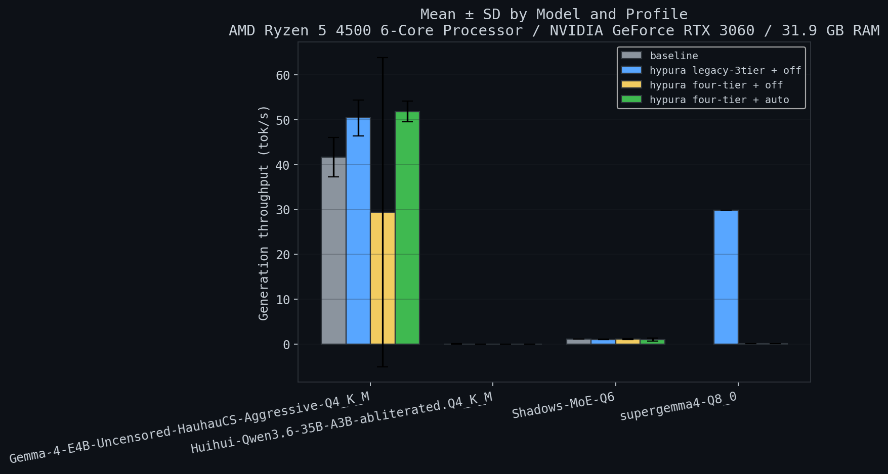
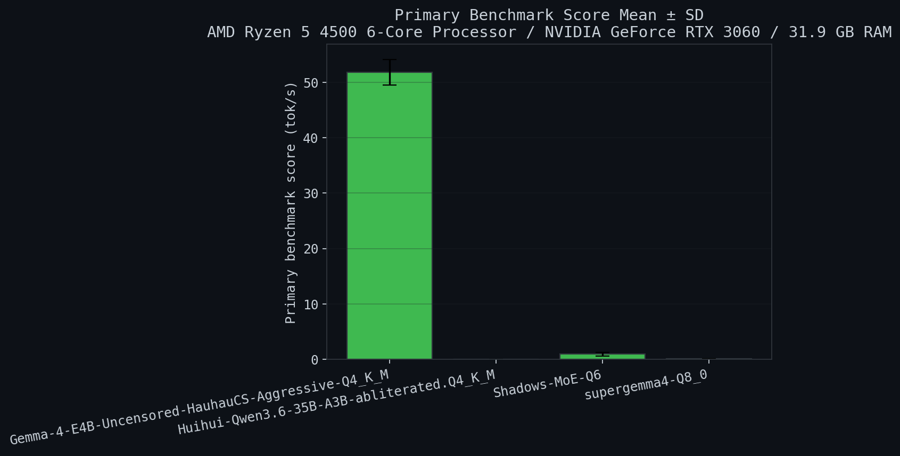

# Hypura Benchmark Charts

*Auto-generated by `benchmarks/gen_charts.sh`*

## Generation Throughput With Error Bars

Mean generation throughput per model/profile. Error bars show sample SD across repeated runs for the same hardware and model.

## Primary Benchmark Score

Primary score uses each result file's `primary_run_label` when available and reports mean +/- SD across repeated runs.

## AMD Ryzen 5 4500 6-Core Processor / NVIDIA GeForce RTX 3060 / 31.9 GB RAM

| Model | Group | n | Mean +/- SD (tok/s) | Min | Max | Mean Prompt Eval (ms) | Mean Wall (ms) |
| --- | --- | ---: | ---: | ---: | ---: | ---: | ---: |
| Gemma-4-E4B-Uncensored-HauhauCS-Aggressive-Q4_K_M | baseline | 2 | 41.681 +/- 4.357 | 38.600 | 44.762 | 3820.1 | 94074.2 |
| Gemma-4-E4B-Uncensored-HauhauCS-Aggressive-Q4_K_M | hypura legacy-3tier + off | 2 | 50.390 +/- 3.980 | 47.576 | 53.204 | 3448.3 | 75808.6 |
| Gemma-4-E4B-Uncensored-HauhauCS-Aggressive-Q4_K_M | hypura four-tier + off | 2 | 29.407 +/- 34.425 | 5.065 | 53.749 | 442.9 | 15539.5 |
| Gemma-4-E4B-Uncensored-HauhauCS-Aggressive-Q4_K_M | hypura four-tier + auto | 2 | 51.835 +/- 2.293 | 50.213 | 53.456 | 279.2 | 21441.9 |
| Huihui-Qwen3.6-35B-A3B-abliterated.Q4_K_M | baseline | 2 | 0.059 +/- 0.050 | 0.023 | 0.094 | 64726.3 | 141837.8 |
| Huihui-Qwen3.6-35B-A3B-abliterated.Q4_K_M | hypura legacy-3tier + off | 2 | 0.020 +/- 0.001 | 0.020 | 0.021 | 76532.3 | 195234.8 |
| Huihui-Qwen3.6-35B-A3B-abliterated.Q4_K_M | hypura four-tier + off | 2 | 0.038 +/- 0.014 | 0.028 | 0.048 | 53522.8 | 127674.1 |
| Huihui-Qwen3.6-35B-A3B-abliterated.Q4_K_M | hypura four-tier + auto | 2 | 0.041 +/- 0.034 | 0.017 | 0.065 | 92419.0 | 181736.3 |
| Shadows-MoE-Q6 | baseline | 2 | 1.121 +/- 0.023 | 1.105 | 1.137 | 101915.8 | 158388.8 |
| Shadows-MoE-Q6 | hypura legacy-3tier + off | 2 | 1.086 +/- 0.029 | 1.065 | 1.107 | 73337.1 | 81767.3 |
| Shadows-MoE-Q6 | hypura four-tier + off | 2 | 1.158 +/- 0.111 | 1.080 | 1.237 | 76206.7 | 103905.2 |
| Shadows-MoE-Q6 | hypura four-tier + auto | 2 | 0.984 +/- 0.334 | 0.747 | 1.220 | 39174.4 | 70253.3 |
| supergemma4-Q8_0 | hypura legacy-3tier + off | 1 | 29.851 +/- 0.000 | 29.851 | 29.851 | 9047.0 | 208393.0 |
| supergemma4-Q8_0 | hypura four-tier + off | 1 | 0.173 +/- 0.000 | 0.173 | 0.173 | 1820.8 | 99672.6 |
| supergemma4-Q8_0 | hypura four-tier + auto | 1 | 0.167 +/- 0.000 | 0.167 | 0.167 | 1825.5 | 68244.7 |

### Multi-group Comparison

| Model | baseline | hypura legacy-3tier + off | hypura four-tier + off | hypura four-tier + auto |
| --- | ---: | ---: | ---: | ---: |
| Gemma-4-E4B-Uncensored-HauhauCS-Aggressive-Q4_K_M | 41.681 +/- 4.357 | 50.390 +/- 3.980 | 29.407 +/- 34.425 | 51.835 +/- 2.293 |
| Huihui-Qwen3.6-35B-A3B-abliterated.Q4_K_M | 0.059 +/- 0.050 | 0.020 +/- 0.001 | 0.038 +/- 0.014 | 0.041 +/- 0.034 |
| Shadows-MoE-Q6 | 1.121 +/- 0.023 | 1.086 +/- 0.029 | 1.158 +/- 0.111 | 0.984 +/- 0.334 |
| supergemma4-Q8_0 | N/A | 29.851 +/- 0.000 | 0.173 +/- 0.000 | 0.167 +/- 0.000 |

## Interpretation Notes

- `Mean +/- SD` is computed per hardware, model, and run label from the benchmark JSON files currently present in `benchmarks/results/`.
- Single-run groups report `SD = 0.000`; treat those as exploratory datapoints rather than stable estimates.
- `baseline` is the non-Hypura comparator from `hypura bench --baseline` when that result was captured.
