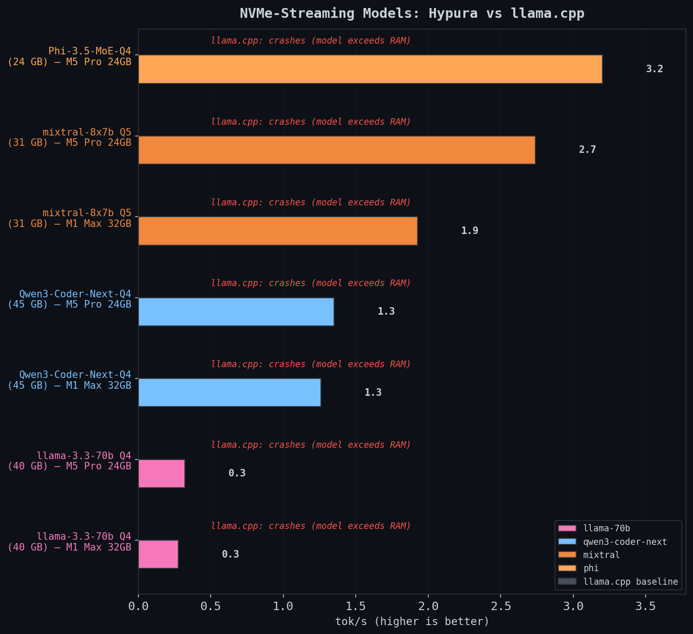
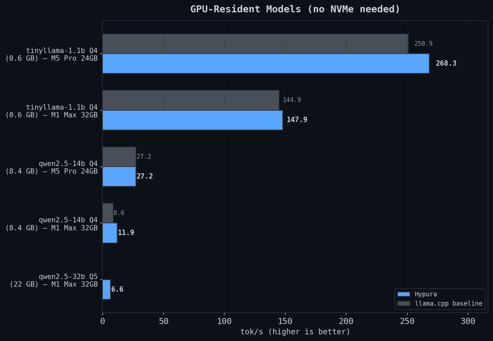
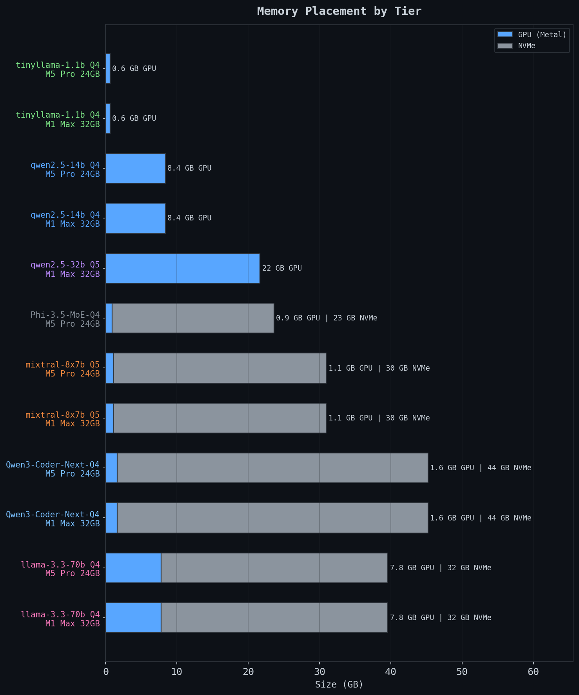
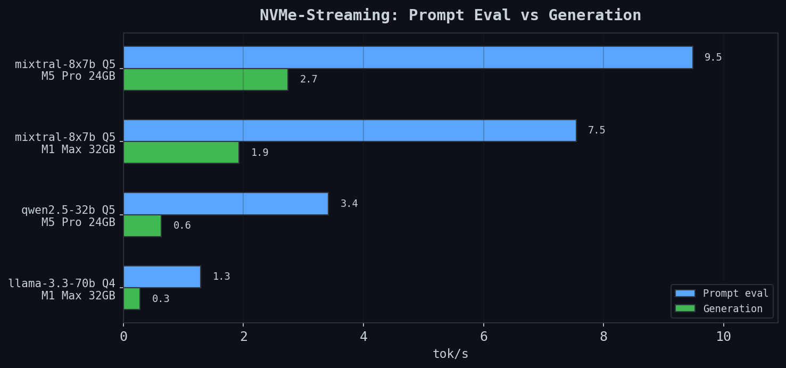

# Hypura Benchmark Charts

*Auto-generated by `benchmarks/gen_charts.sh`*

## NVMe-Streaming Models

## GPU-Resident Models

## Memory Placement

## Prompt Eval vs Generation

## Hardware

- **Apple M1 Max**, 32 GB unified, 5.1 GB/s NVMe seq read
- **Apple M5 Pro**, 24 GB unified, 33.4 GB/s NVMe seq read

*Generated 2026-03-21*
